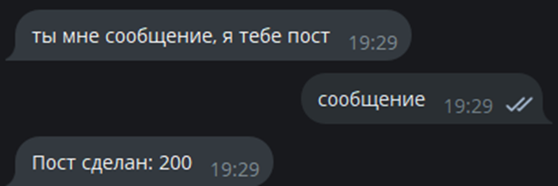

# Задание

Принять текстовое сообщение от собеседника бота. Отправить его в социальную сеть вконтакте.

## Дополнительное задание:

- Сделать пост у себя на странице с текстом 

# Реализация

Напишем код бота с меню на питоне, который будет иметь возможность делать пост на моей странице с текстом, введенным пользователем в чате. В целях экономии числа ботов, данный функционал был добавлен к боту из предыдущей лабораторной. 

# Пример работы

