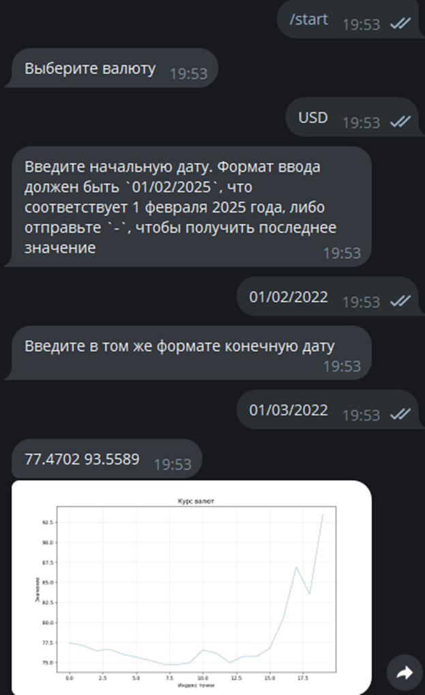

# Задание

Телеграм бот должен выдавать курс валюты по отношению к рублю. Валюта выбирается преподавателем. Дата вводится пользователем с клавиатуры 

## Дополнительно

Бот должен иметь клавиатуру с выбором из не менее чем 2 разных валют

# Реализация

Напишем код бота с меню на питоне, который будет иметь возможность выводить курс выбранной пользователем в меню валюты в определенную дату.

**Выбранные валюты:** AZN, USD, EUR, CNY. Выбор валют в данной программе может быть любой, поскольку коды валют получаются через запрос к ЦБ РФ. Бот может выдавать актуальные данные или данные за конкретный временной промежуток в зависимости от ввода пользователя. Во втором случае будет выведен график с курсом валюты по отношению к рублю. 

# Пример работы

