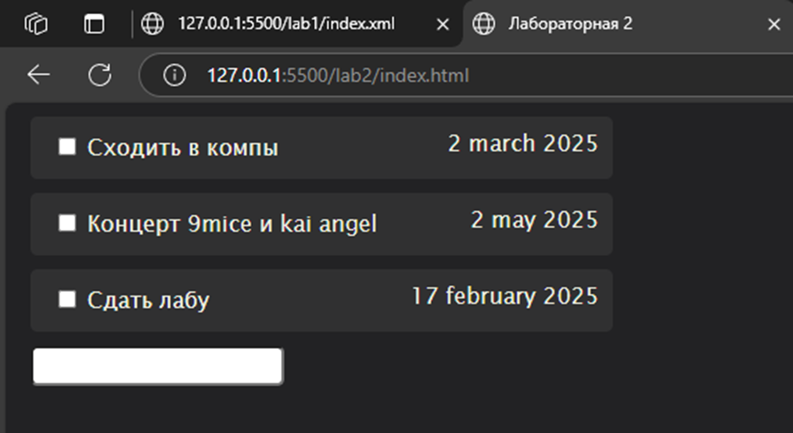

# Задание
Создать HTML страницу с встроенным скриптом, который будет обрабатывать выданный вам XML файл. Вам необходимо вывести на экран все элементы третьего, последнего уровня вложенности одного из элементов второго уровня. 

## Дополнительное задание: 
В HTML файле создать поле ввода, в которое вводиться номер элемента второго уровня, для которого выведутся элементы третьего уровня

# Реализация
Вдобавок к существующему XML файлу из первой лабораторной работы (см. предыдущий отчет) создаем HTML страницу с отдельным скриптом (отдельным файлом js), который будет обрабатывать выданный вам XML файл, выводя на экран все элементы третьего, последнего уровня вложенности одного из элементов второго уровня, номер которого введен в специальное поле ввода

Также по **просьбе преподавателя** была реализована возможность отображения напоминания по ее индексу, а также при вводе отрицательных значений выводятся все напоминания. В случае ввода индекса, к которому не относится ни один элемент, выводится соответствующее сообщение

# Пример работы

.png)

.png)
