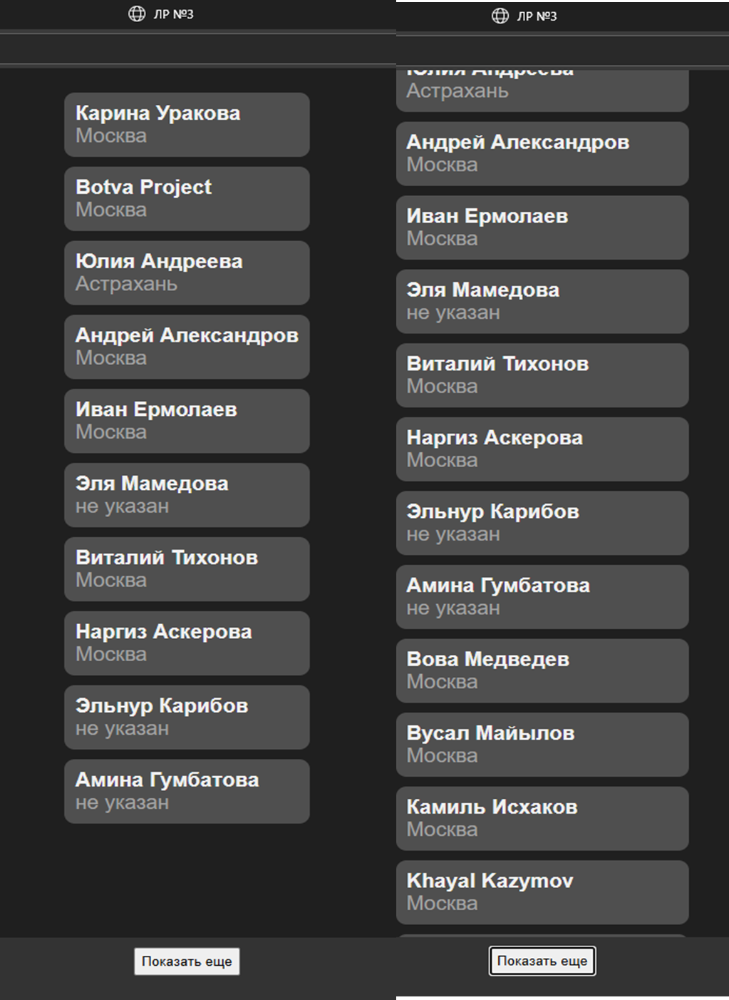

# Задание
Создать HTML страницу с вложенным javascript, который бы выдавал список ID ваших друзей вконтакте. Для каждого друга необходимо вывести дополнительную информацию, согласно варианту.
## Дополнительное задание:
Оформить возвращенный JSON в виде таблицы HTML. 
# Реализация
Напишем HTML разметку и js код, который будет, используя методы VK API, выдавать список моих друзей в социальной сети ВК с указанными в профиле городами (если они указаны). Выводятся первые 10 человек из списка, остальные – по нажатию на кнопку еще, которая отображает еще 10 человек.

# Пример работы

