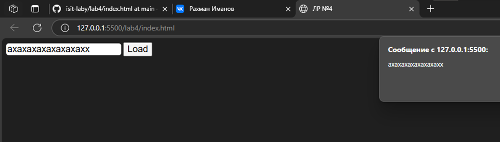

# Задание

Создать HTML страницу с встроенным скриптом, который будет в зависимости от варианта выполнять следующее действие: обновлять статус страницы
# Реализация

Напишем вложенный скрипт JS внутри документа html, который будет, используя методы VK API, изменять статус страницы в социальной сети ВК. Дополнительно реализовал возможность ввода текста, который будет отображаться в статусе. 
# Пример работы

.png)