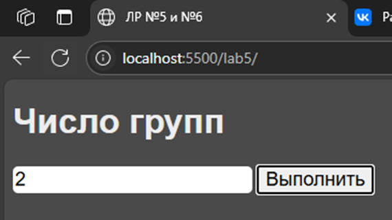

# Задание
Создать HTML страницу с встроенным скриптом, который будет в зависимости от варианта выполнять следующие действия:

- создать пост у себя на стене. Этот пост должен содержать названия и количество участников пяти групп, в которых вы состоите.

## Дополнительное задание
Создать поле ввода. В поле ввода вводится число, которое ограничивает общее количество аккаунтов, лайков, друзей, постов или групп, с которыми вам нужно работать

# Реализация

Напишем вложенный скрипт JS внутри документа html, который будет, используя методы VK API, получать список id групп пользователя и через этот идентификатор получать основную информацию о сообществах (название и число подписчиков). После этого данные формализуются в список и выводятся на странице пользователя. В рамках выполнения данной лабораторной работы было выявлено, что использование асинхронных методов является необходимым при выполнении большого числа запросов в vk api, поэтому помимо 5 лабораторной работы, была сделана еще и 6. Этап получения списка сообществ сделан через вызов асинхронной функции. 

# Пример работы

.png)