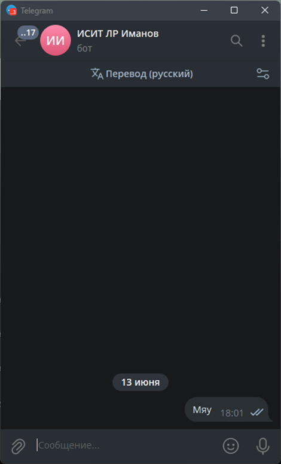

# Задание

Создать бота для Telegram. Отослать ему сообщение со своего аккаунта. С помощью API прочитать это сообщение. Создать HTML файл, который с помощью JavaScript по API прочитает это сообщение и выведет его на странице.

## Дополнительное задание

Получить фотографию аккаунта пользователя, который отправил последнее сообщение бот

# Реализация

Прежде чем начинать разработку, зарегистрируем бота, получив его токен. Для этого в Telegram существует специальный бот — @BotFather.

Далее напишем вложенный скрипт JS внутри документа html, который будет, используя методы Telegram API, читать отправленное ему сообщение и выводить это сообщение вместе с ником пользователя на странице. Также реализуем вывод фотографии аккаунта пользователя, который отправил последнее сообщение боту.

# Пример работы

.png)