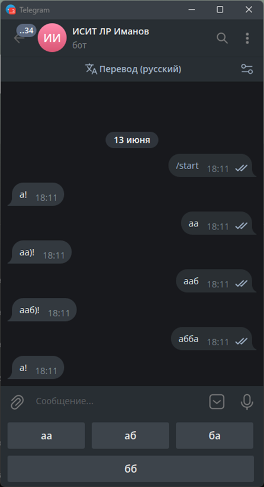

# Задание

Создать меню (клавиатуру) для вашего бота. Модифицируйте текст пунктов меню, не используйте примеры из теории ниже. На нажатие каждой клавиши должен выдаваться ответ, глубина вложенности вопросов и ответов должна быть не меньше двух, т.е. на первый ответ пользователя бот присылает новую клавиатуру с новыми вопросами. Всего различных клавиш должно быть не меньше восьми.

## Дополнительное задание

Вывести счётчик нажатий каждой клавиши

# Реализация

Напишем код бота с меню, который на старте отправляет а!, после чего можно ответить аа либо аб либо ба либо бб, на что он ответит то же самое, но со скобочкой и восклицательным знаком, после чего число букв будет прибавляться, пока не дойдет до 4 букв. После этого цикл начнется заново.

Также в бота встроена команда /count – для отображения общего числа нажатий.

# Пример работы

.png)