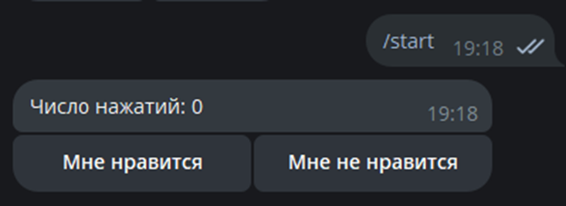

# Задание

Создать инлайн-клавиатуру для вашего бота. Результаты выбора должны фиксироваться.

## Вариант:

1. Под сообщением от бота должно быть два выбора: «Мне нравится» и «Мне не нравится» с счётчиком нажатий, а также создана кнопка статистики выборов

# Реализация

Напишем код бота с инлайн-меню на питоне, который будет предлагать два выбора на каждое свое сообщение: «Мне нравится» и «Мне не нравится», а также будет иметь счетчик нажатий данных кнопок. За основу возьмем бота из предыдущей лабораторной работы.

По нажатию на «Мне нравится» счетчик увеличивается на 1, «Мне не нравится» - убавляется. Счетчик обновляется в самом сообщении, то есть после нажатия на старт бот пришлет одно сообщение и будет менять только его, не отправляя новых.

# Пример работы

